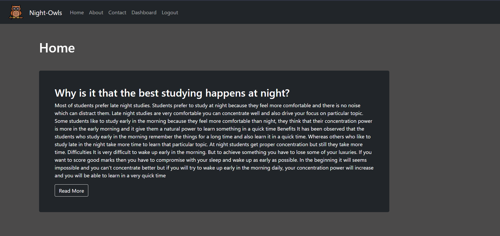
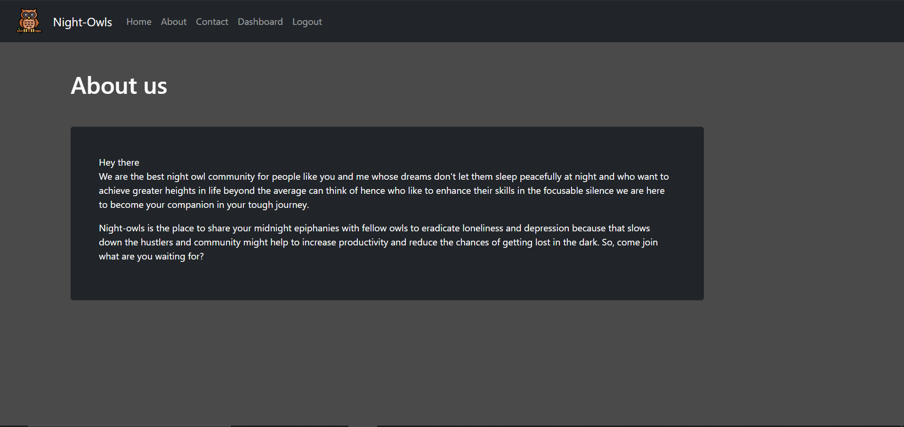
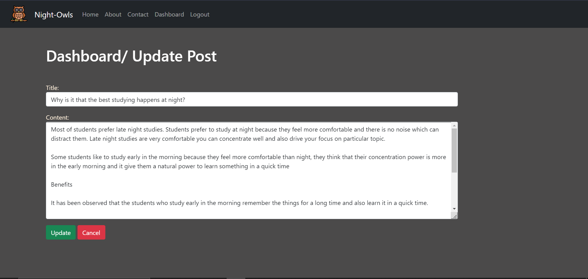

# Night Owls

### Night-owls is the place to share your midnight epiphanies with fellow owls to eradicate loneliness and depression because that slows down the hustlers and community might help to increase productivity and reduce the chances of getting lost in the dark. So, come join what are you waiting for?

 

### It is a community for people like you and me whose dreams don't let them sleep peacefully at night and who want to achieve greater heights in life beyond the average can think of hence who like to enhance their skills in the focusable silence we are here to become your companion in your tough journey.

1. Home Page:

    

2. About page:

    

3. Contact Page:

    

4. Signup page:

    

5. Login page:

    

6. Dashboard page:

    

7. Add-Post page:

    

8. Edit-Post page:

    

9. Admin panel:

    

10. Groups in Application:

    

11. Admin Permissions:

    

12. Author Permissions:

    

13. Users Registered:

    

14. Posts-Table Image:

    

Hope you would like to join the night owl community. Suggestions are always welcome.